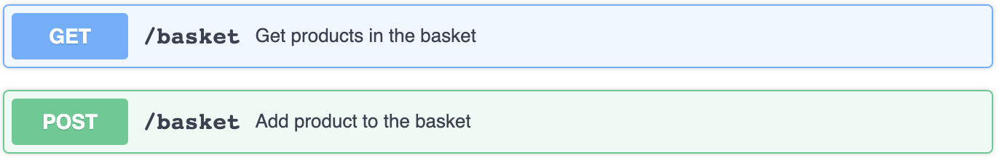

# Snowplow Micro Tracker

Snowplow tracking technical assignment

## About Project

An example shopping app implementation that embeds a Snowplow tracker to send behavioral data to Snowplow Micro.





## Technologies

The project has been created using these technologies:

* **Python** as programming language 
* **Flask** as micro-framework for web application development
* **Jinga2** as templating engine
* **pytest** as unit testing library for Python projects

## Setup & Installtion

Make sure you have the latest version of <a href="https://www.python.org/downloads/">Python</a> and <a href="https://pypi.org/project/pip/">pip</a> installed.

```bash
git clone <repo-url>
```

```bash
pip install -r requirements.txt
```

> For the installation of the [Snowplow Micro](https://github.com/snowplow-incubator/snowplow-micro/). There are set up instructions for Micro in the readme.

After installation of the Snowplow Micro, open a terminal and type the command below

```bash
docker run --mount type=bind,source=$(pwd)/example,destination=/config -p 9090:9090 snowplow/snowplow-micro --collector-config /config/micro.conf --iglu /config/iglu.j\son
```

## Running The App

```bash
python main.py
```

## Viewing The App

Go to `http://127.0.0.1:5000/store`

## Testing the App

To run all the tests:

```sh
python -m pytest -v
```

To check the code coverage of the tests:

```sh
python -m pytest --cov-report term-missing --cov=project
